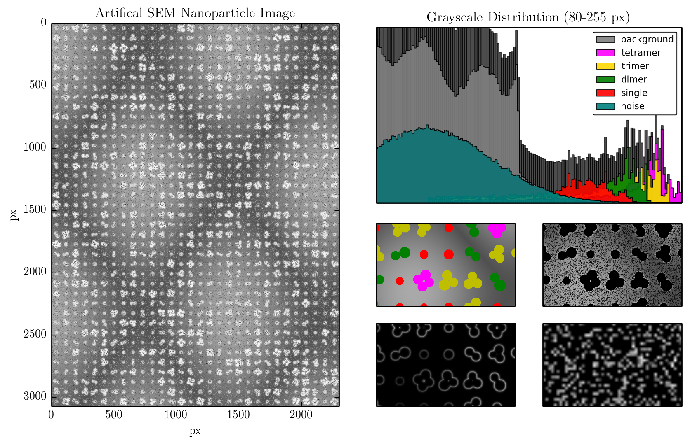

John Hunter 2014 Excellence in Plotting Submission
==================================================

- Adam Hughes (hugadams@gwmail.gwu.edu)

- The George Washington University

- 3/21/14

`View this submission in notebook form`_.  PDF and .png versions of plots are included as well.

.. _View this submission in notebook form : http://nbviewer.ipython.org/github/hugadams/JH_plotting_2014/blob/master/Hughes_jh2014.ipynb

Abstract
--------

Nanotechnology and image processing are two of the most rapidly growing inter-disciplinary research fields.  Gold nanoparticles have recently appeared in novel applications ranging from photovoltaics[1], to protein sensing[2],and even to boiling water[3].   Likewise, fascinating applications of image processing, for example in areas like computer vision, ensure vested interest from academic and commercial organizations for the foreseeable future.

High-resolution microscopy (HRM) is the keystone between nanotech and image processing.  This is not surprising, since small variations in nanoparticle morphology, both at the individual particle and ensemble scale, drastically affect the macroscopic properties of the composite.  One would expect to find a considerable body of knowledge and software geared towards HRM nanomaterial processing; however, this is not the case.  Despite similar requirements in image acquisition and processing, fields like cell profiling[4] vastly overshadow nanotech. HRM in terms of knowledge base and dedicated software.  Using scientific Python, especially Scikit-image, we have begun addressing this disparity.

We sought to create a guide for nanomaterial image processing, but didn't want to make subjective assessments based on our sample images.  Using Scikit-image and a complementary particle analysis library, `PyParty`_, we set out to build artificial electron microscope images.  We could then compare the performance of preprocessing and segmentation algorithms in the context of nanoscience, and begin to assemble targeted workflows.  The image features particles of varying multiplicity, brightness and orientation, patterned over a shadowed background.  Realistic particle edges were obtained with Gaussian smoothing, and normal noise was generated in Numpy.  We have already purposed these images to several endeavors, from assessing the performance of new supervised object classification tools[5], to building predictive models for nanoparticle-ligand binding on rough thin films.

.. _PyParty : https://github.com/hugadams/pyparty

Submission
----------

Submitted below is the artificial (3072x2304) nanoparticle image, accompanied by a grayscale histogram, decomposed into the various image components of noise, background, and separated particle species (dimers, trimers etc..).  Four additional subplots show, in clockwise order:
   
   - nanoparticle (color-labeled by species)
   - image background with particles AND noise pixels subtracted
   - Guassian-smoothed particle edges (in false color)
       - Shading is proportional to the strength of the image gradient at that point.
   - zoomed-in look at the Gaussian noise.

References
----------
[1] Shiva Shahin, Palash Gangopadhyay, and Robert a. Norwood. Ultrathin organic bulk heterojunction solar cells: Plasmon enhanced performance using Au nanoparticles. Applied Physics Letters, 101(5):053109, 2012.

[2] V V R Sai, Tapanendu Kundu, and Soumyo Mukherji. Novel U-bent fiber optic probe for localized
surface plasmon resonance based biosensor. Biosensors & bioelectronics, 24(9):2804–9, May 2009.

[3] Phil McKenna. Nanoparticles Make Steam without Bringing Water to a Boil. MIT Technology Review, 2012.

[4] Kamentsky L, Jones TR, Fraser A, Bray M, Logan D, Madden K, Ljosa V, Rueden C, Harris GB, Eliceiri K, Carpenter AE (2011) Improved structure, function, and compatibility for CellProfiler: modular high-throughput image analysis software. Bioinformatics 2011/doi. PMID: 21349861 PMCID: PMC3072555

[5] C. Sommer, C. Straehle, U. Köthe, and F.A. Hamprecht.
8th IEEE International Symposium on Biomedical Imaging (ISBI 2011), in press
